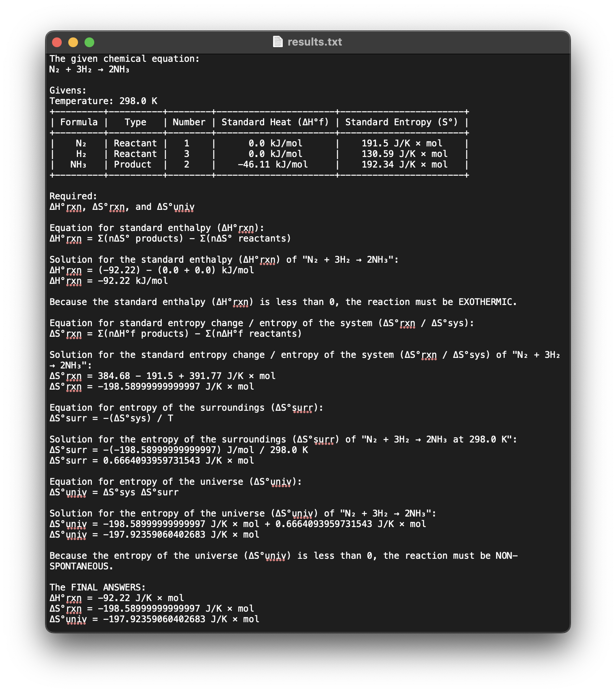

# Chemtech Codex


[](https://github.com/astral-sh/ruff)

_This repository does not follow conventional commit messages because it was made solely for academic purposes._

Chemtech Codex is a simple CLI-based calculator that solves and integrates General Chemistry 2 concepts. It takes inputs from the user and uses predetermined formulas to calculate values. The following General Chemistry 2 topics are covered:

1. **Thermochemistry** - Standard Enthalpy, Standard Entropy Change / System Entropy, Entropy of The Surroundings, Entropy of The Universe.
2. **Chemical Kinetics** - First Order Reactions
3. **Chemical Equilibrium** - Chemical Equilibrium Constants Using Molarities and Pressures
4. **Acids and Bases** - Potential of Hydrogen Ions and Hydroxide Ions

## Usage

```bash
python3 Calculator.py
```

Run the script through the terminal (the terminal must be opened in the same folder as the `Calculator.py` file).  The script gives you instructions throughout on what you have to input.

## Example

<div style="display:flex">
   
   
</div>

---


# De La Salle Santiago Zobel School

## Senior High School (Grade 12)

Integrated Performance Task:

- **General Chemistry 2** - Performance Task 1 (Technical Solution: Digital Technology)
- **Empowerment Technologies** - Performance Task 1 (Digital Technology)

### Groupmates (12G-Chem-4)

- Patrick Gabriel Cabero Halili (s2011079)
- Allen Conner Cole Hizon (s2011090)
- Juan Jose Bachmann Lacson (s2011073)
- _**Louis Raphael Villaluna Panaligan (s2018402)**_
- Anton Jefferson Lachica Pangilinan (s2012385)
- Josef Benedict Aguirre Plata (s2022428)
