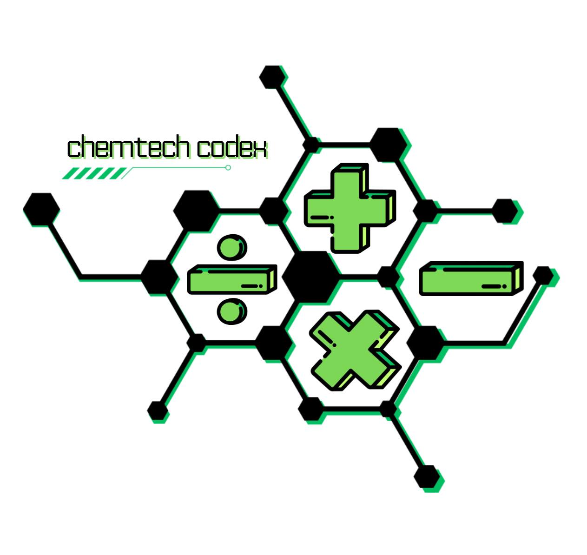

# Chemtech Codex


The Chemtech Codex is a simple CLI-based calculator that solves and integrates General Chemistry 2 concepts. It takes inputs from the user and uses predetermined formulas to calculate values. The following General Chemistry 2 topics are covered:

1. **Thermochemistry**

    Standard Enthalpy, Standard Entropy Change / System Entropy, Entropy of The Surroundings, and Entropy of The Universe.

2. **Chemical Kinetics**

    First Order Reactions.

3. **Chemical Equilibrium**

    Chemical Equilibrium Constants Using Molarities and Pressures.

4. **Acids and Bases**

    Potential of hydrogen ions and potential of hydroxide ions.

*This repository does not follow conventional commit messages because it was made solely for academic purposes.*

---

## Installation

### Python 3.x

You can download the latest version of Python from the [official website](https://www.python.org/downloads/).

For MacOS users, you can download Python through Homebrew instead:

```bash
brew install python@3
```

### Dependencies

If you are downloading this repository:

```bash
pip3 install -r requirements.txt
```

Otherwise:

```bash
pip3 install prettytable
```

## Usage

### Running

Run the script through the terminal (Terminal must be opened at the same folder as the `Calculator.py` file!):

```bash
python3 Calculator.py
```

The script gives you instructions throughout on what you have to input.

### Example


---

## General Chemistry Group 4 (12G)

- Patrick Gabriel Cabero Halili (s2011079)
- Allen Conner Cole Hizon (s2011090)
- Juan Jose Bachmann Lacson (s2011073)
- **Louis Raphael Villaluna Panaligan (s2018402)** *(Me)*
- Anton Jefferson Lachica Pangilinan (s2012385)
- Josef Benedict Aguirre Plata (s2022428)

---


# De La Salle Santiago Zobel School

Senior HighSchool

General Chemistry 2 and Empowerment Technologies
